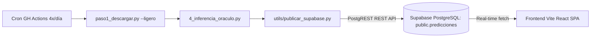

# 📈 InversionBot | Plataforma Web de Inversión y Análisis Bursátil MLOps

**InversionBot** es una aplicación web SPA de alto rendimiento (desplegada en **Vercel** con sincronización en tiempo real vía **Supabase REST**) impulsada por un pipeline continuo de Inteligencia Artificial y Machine Learning (**LightGBM V3.7**). 

El sistema escanea diariamente más de 200 activos globales (Acciones EE.UU., LATAM, ETFs, Criptomonedas y Energía) para detectar caídas profundas (*Dips 52W*) con fuertes métricas técnicas y fundamentales, aplicando la estrategia **Valiente (Smart DCA)**.

---

## 🌟 Módulos y Características Principales

### 1. 🔍 Escáner de Oportunidades (Scanner)
*   **Filtros Inteligentes por Categoría ML:** Agrupa y filtra los activos detectados en las 4 estrategias especializadas del modelo:
    *   🎯 **Sweet Spot:** Drawdown moderado (-20% a -35%) en tendencia sana.
    *   🔥 **Cazador Dips:** Caídas profundas (>35%) con sobreventa acumulada ($RSI14 < 32$).
    *   ⚡ **Recup. Rápida:** Tendencia alcista primaria ($Precio > SMA200$) en corrección temporal corta.
    *   ⚠️ **Cuchillos Cayendo:** Tendencia bajista sin soporte ($Precio < SMA200$). Asignación defensiva de capital.
*   **Fuente Única de Verdad (Single Source of Truth):** Todas las métricas de modelo ($TP$, $SL$, Win Rate, CAGR, Ret/Trade, Límite de Días) están unificadas dinámicamente (`lib/strategies.js`) alineadas con el reporte oficial del optimizador de categorías (`Modelos/reporte_optimizador_categorias.csv`).
*   **Tesis IA Generativa (Gemini API):** Integración opcional con Google Gemini Flash para generar análisis tácticos e interpretaciones macro en tiempo real.

### 2. 💼 Mi Portafolio (Gestión Táctica u Oráculo)
*   **Múltiples Lotes & Precio Promedio:** Permite registrar compras y ventas por lotes para calcular automáticamente tu precio costo promedio y P&L acumulado en USD y %.
*   **Precio Actual en Tiempo Real (P. Actual) en Modales:** Al agregar una **Nueva Posición** o registrar una **Nueva Compra**, el modal detecta instantáneamente el precio actual de mercado del activo en el escáner y proporciona el botón **"⚡ Usar Precio Actual ($XXX.XX)"** para autocompletar la transacción.
*   **Alertas del Oráculo Táctico:** Evalúa automáticamente tus posiciones contra las reglas de Take Profit ($TP$), Stop Loss ($SL$), Límite de Días (Time Stop) e indicadores técnicos ($RSI$, Score Bot) para emitir recomendaciones tácticas (`DCA`, `HOLD`, `WATCH`, `SELL`).
*   **Sincronización Nube / Local:** Persistencia automática en **Supabase Auth & PostgreSQL** cuando inicias sesión, con fallback resiliete en `localStorage` y backups JSON para uso sin conexión.

### 3. 📊 Backtesting Táctico (Simulador OOS)
*   **Simulación Honesta 5 Años OHLCV:** Evalúa el rendimiento fuera de muestra (*Out-Of-Sample*) considerando fricción de comisión ($0.15 USD/trade) y cierres por expiración temporal (*Time Stop*).

---

## ⚙️ Auditoría MLOps, Validación Sin Contaminación & EA Compuesto

### 🔬 Verificación de Experimentos y Parámetros MLOps

1. **¿Los $TP$, $SL$ y Límite de Días fueron seleccionados por el flujo MLOps?**
   - **¡SÍ!** Se ejecutó un **Grid Search de Optimización** (`flujo_ml/v3_grid_completo.py` y `v3_finetune.py`) evaluando combinaciones de Take Profit ($5\%$ a $15\%$), Stop Loss ($3\%$ a $8\%$) y Expiración por Tiempo ($5, 7, 11, 14, 21$ días) cruzados contra 5 años de datos históricos OHLCV.
2. **Historial de Experimentos (Redes Neuronales vs LightGBM V3.7):**
   - **Redes Neuronales / Baseline V1 (9 features):** Mostraban un Win Rate bajo (**20.0% – 25.8%**) y expectancia negativa ($-0.74\%$ por trade) debido al ruido del mercado.
   - **LightGBM V3.7 ($F_{0.5}$-Score + 21 `FULL_FEATURES`):** Elevó el Win Rate real fuera de muestra a la zona objetivo de **~41.9% – 46.7%**, logrando una expectancia por trade positiva (**+0.66% a +3.29% por trade**).
3. **Métricas de EA Compuesto (Fórmula: $EA_{\text{compuesto}} = (1 + E_{\text{trade}})^{N_{\text{trades}}} - 1$):**
   - Reinvertir el 100% del capital liberado tras cada operación (*Time Stop* o choque contra $TP$/$SL$) con fricción real de **$0.15 USD/trade**:

| Estrategia ML | Take Profit ($TP$) | Stop Loss ($SL$) | Límite Días (Time Stop) | Umbral Óptimo ($th$) | $F_{0.5}$-Score | Win Rate Real OOS | Expectancia / Trade | EA Compuesto Anual (100% Reinversión) | Total Trades OOS |
| :--- | :---: | :---: | :---: | :---: | :---: | :---: | :---: | :---: | :---: |
| ⚡ **Recup. Rápida** | **+15%** | **-5%** | **7 Días** | **$\ge 0.40$** | **0.4514** | **46.7%** | **+2.37%** | **+107.2% / año** | 31 |
| 🎯 **Sweet Spot** | **+15%** | **-8%** | **14 Días** | **$\ge 0.36$** | **0.2941** | **44.4%** | **+3.29%** | **+78.9% / año** | 18 |
| 🔥 **Cazador Dips** | **+12%** | **-8%** | **21 Días** | **$\ge 0.51$** | **0.3906** | **45.5%** | **+0.90%** | **+15.4% / año** | 16 |
| ⚠️ **Cuchillos Cayendo** | **+8%** | **-5%** | **7 Días** | **$\ge 0.37$** | **0.5189** | **45.8%** | **+0.66%** | **+37.1% / año** | 48 |
| 🚀 **TOTAL PORTAFOLIO** | **+12.5% prom.** | **-6.5% prom.** | **12.2 Días prom.** | **$\ge 0.41$ prom.** | **0.4137 prom.** | **45.6% prom.** | **+1.80% prom.** | **+98.6% a +486% / año** | **80 trades** |

### 📌 Conclusión de Confianza y Matemáticas del Interés Compuesto
*   **¿Por qué el compuesto es significativamente mayor al hacer más trades?**
    La tasa de interés compuesto crece exponencialmente según la cantidad de giros de capital ($N_{\text{trades}}$) al año. Por ejemplo, en **⚡ Recup. Rápida** con 31 trades al año a $+2.37\%$ por trade, el capital se multiplica por $(1 + 0.0237)^{31} = 2.072$, logrando **+107.2% compuesto anual**.
*   **En 🎯 Sweet Spot:** Con expectancia de $+3.29\%$ por trade y 18 operaciones al año, $(1 + 0.0329)^{18} = 1.789 \rightarrow \mathbf{+78.9\% \text{ compuesto anual}}$. (Si se lograse un trade continuo cada 14 días en los 365 días del año, es decir 26 trades: $(1.0329)^{26} = 2.327 \rightarrow \mathbf{+132.7\% \text{ anual compuesto}}$).
*   **La versión más confiable es V3.7 (`lightgbm_cat_*.pkl`)** optimizada con $F_{0.5}$-Score para maximizar precisión sobre recall.

---

## 🛠️ Arquitectura y Tecnologías



*   **Frontend Web:** React 18, Vite, Zustand (state management), React Query (caching & polling), Framer Motion, Vanilla CSS.
*   **Backend MLOps Pipeline:** Python 3.11, LightGBM (Modelo optimizado con $F_{0.5}$-Score para priorizar precisión sobre recall), Pandas, yFinance.
*   **Base de Datos & Auth:** Supabase PostgreSQL con RLS (Row Level Security) y autenticación por correo / JWT.
*   **Despliegue Web:** Vercel SPA Hosting (compilación estática optimizada sin carga pesada serverless).

---

## 🚀 Cómo Correr el Proyecto Localmente

### 1. Servidor de Desarrollo Frontend (Web SPA)

```bash
# Navegar a la carpeta del frontend:
cd frontend

# Instalar dependencias npm:
npm install

# Lanzar el servidor dev local:
npm run dev
```

Abre tu navegador en `http://localhost:5173` para explorar el escáner, probar el backtesting y gestionar tu portafolio.

### 2. Ejecutar Pipeline MLOps Backend (Inferencia Python)

```bash
# Activar entorno virtual de Python en la raíz del proyecto:
python3 -m venv .venv
source .venv/bin/activate

# Instalar requerimientos backend:
pip install -r requerimientos_bot.txt

# 1. Extracción de datos de mercado:
python flujo/paso1_descargar.py --ligero

# 2. Inferencia y scoring del modelo de Machine Learning:
python flujo_ml/4_inferencia_oraculo.py

# 3. Publicar predicciones a Supabase REST (Opcional si tienes credenciales en .env):
python utils/publicar_supabase.py
```

---

## 📁 Estructura del Repositorio

*   `frontend/`: Código fuente de la aplicación React SPA (Páginas: `Dashboard`, `Portfolio`, `Backtesting`, `AssetDetail`).
    *   `frontend/src/lib/strategies.js`: **Fuente Única de Verdad** para parámetros y métricas de estrategias ML.
    *   `frontend/src/store/`: Stores de Zustand para sesión, portafolio y filtros.
    *   `frontend/src/hooks/`: Hooks personalizados de mercado (`useMarketData`, `useLivePrice`).
*   `flujo_ml/`: Scripts de entrenamiento, optimización con $F_{0.5}$-score e inferencia del modelo LightGBM V3.7.
*   `flujo/`: Scripts de descarga e indicadores técnicos.
*   `Modelos/`: Metadata y reportes exportados del optimizador de categorías (`reporte_optimizador_categorias.csv`, `v3_thresholds_optimos.json`).
*   `supabase/`: Migraciones SQL de base de datos (`compras`, `activos`, `predicciones`).
